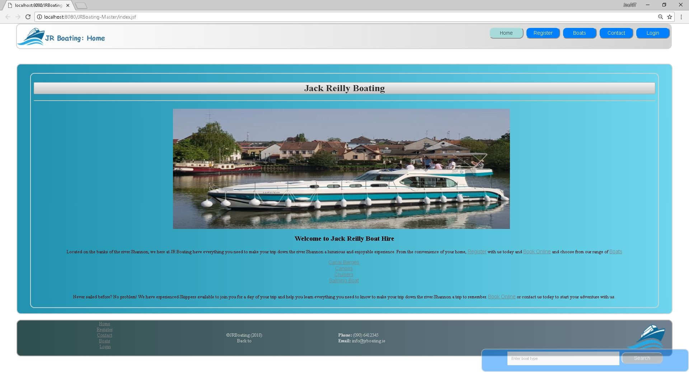
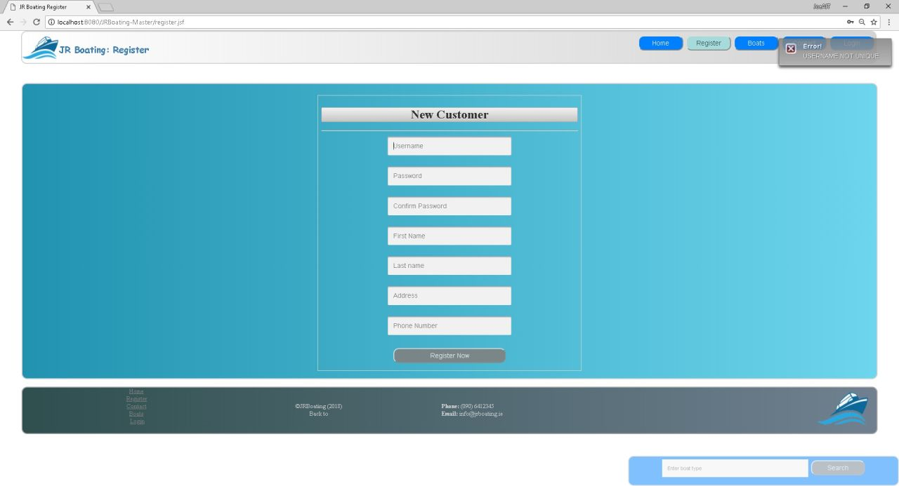
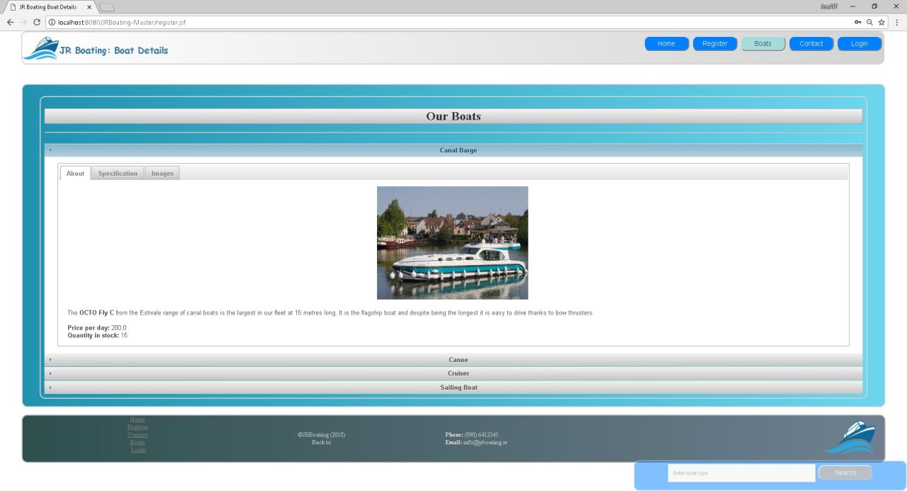
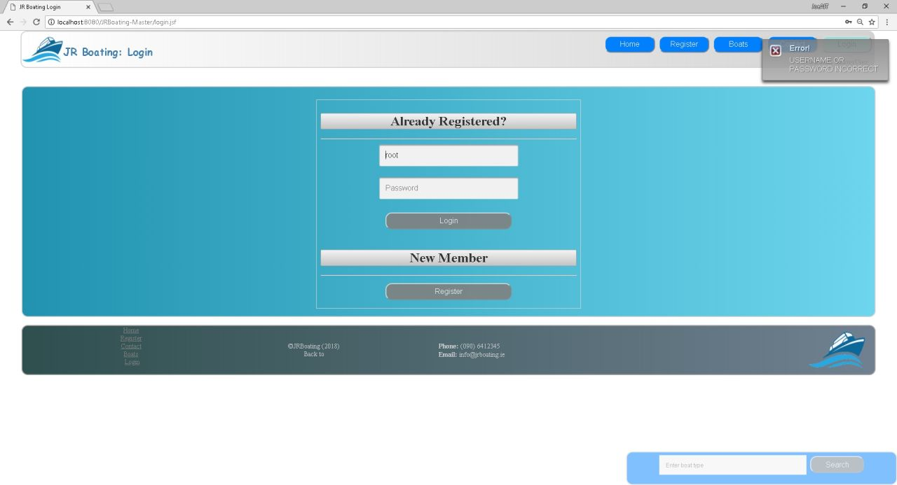
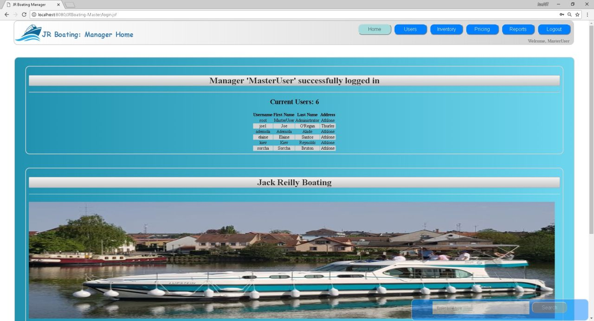
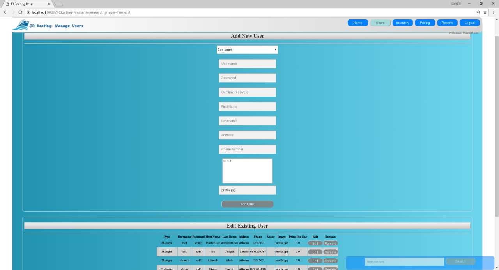
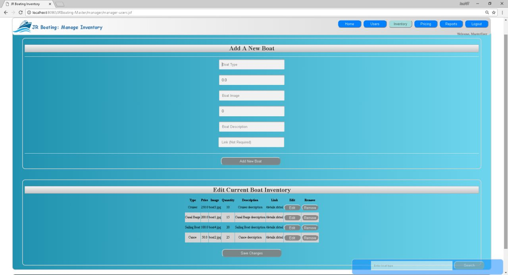
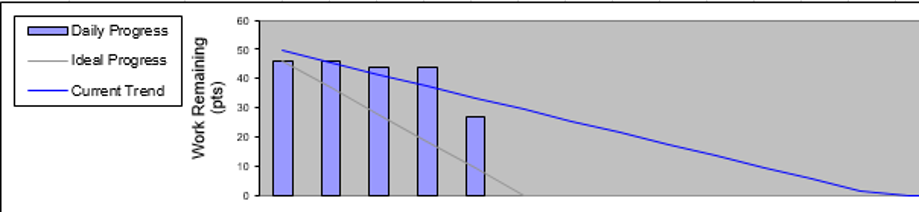
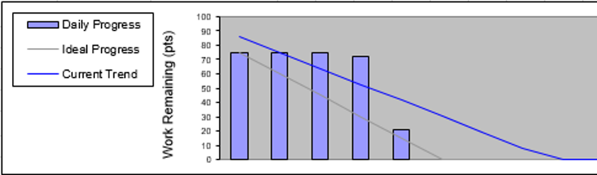

# Certificate in Software Engineering
### Team Project: JR Boating
### 10/08/2018
---
## Team Members
| Name: | Student No: |
| --- | --- |
| **Joe O'Regan** | A00258304 |
| **Elaine Santos G Ottero** | A00248619 |
| **Ademola Alade** | A00212817 |
| **Kiev Reynolds** | A00258306 |
| **Sorcha Bruton** | A00258344 |
---
## Screenshots

###### JR Boating: Home

###### JR Boating: Register

###### JR Boating: Boat Details

###### JR Boating: Login

###### JR Boating: Manager Home

###### JR Boating: Manage users

###### JR Boating: Manage inventory

---
## Definition of Done
* For a user story to be declared done unit testing must be fully developed and pass all unit tests. 
* Unit testing code coverage must be at least 85%.
* All acceptance criteria must be tested and passed. 
* All documentation relating to the user story must be completed, including the unit test template, the user guide and the bug list (if applicable).

---
## Sprints

### Sprint 1:

|  | User Story | Planned | In Progress | Done
| --- | --- |---| ---| ---|
| 1 | **Manager: Login** | Code, Unit Test, User Guide, System Test | **Elaine**: Code & unit test and user guide, **Sorcha**: System tests | - |
| 2 | **Manager: Add boat** | Code, Unit Test, User Guide, System Test | **Ade**: Code & unit test, **Sorcha**: System tests | - |
| 3 | **Manager: View inventory** | Code, Unit Test, User Guide, System Test | **Sorcha**: code & unit test, system tests | - |
| 4 | **Manager: Add pricing structure** | Code, Unit Test, User Guide, System Test | - | **Joe**: code,test |
| 5 | **Manager: View pricing structure** | Code, Unit Test, User Guide, System Test | - | **Joe**: code,test |
| 6 | **Customer: Search site** | Code, Unit Test, User Guide, System Test | - | **Joe**: code |
| 7 | **Customer: Register** | Code, Unit Test, User Guide, System Test | - | **Joe**: Code |
| 8 | **Customer: Login** | Code, Unit Test, User Guide, System Test | - | **Joe**: Code |
| 9 | **Customer: Book boat** | Code, Unit Test, User Guide, System Test | - | **Joe**: Code |
| 10 | **Customer: Pay boat deposit** | Code, Unit Test, User Guide, System Test | - | - |

###### JR Boating: Sprint 1: Burn Down Chart
---

### Sprint 2:

#### Sprint 2: Goal
* A registered customer will be able to search the site, reserve a boat, edit boat bookings and pay a deposit.
* The manager will be able to create employee accounts and facilitate adding account details, boat prices and the pricing structure.
* The site will be intuitive to navigate and have a pleasant appearance.
* The front desk staff and skipper will be able to login and out of the site.

###### JR Boating: Sprint 2: Burn Down Chart 

---
## Code Coverage

###### JR Boating: Code Coverage 

